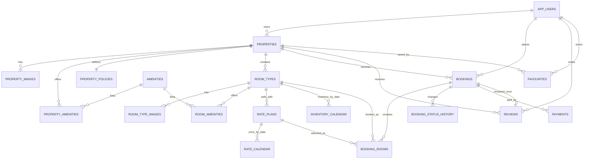

# ERD RoomEase

## Ý nghĩa hai bảng lịch

- `inventory_calendar`: tồn phòng của **một loại phòng trong một ngày**. Phòng còn lại = `allotment - reserved_rooms`.
- `rate_calendar`: giá bán của **một gói giá trong một ngày**. Một loại phòng có thể có gói linh hoạt, không hoàn tiền, kèm bữa sáng…

Không nên chỉ lưu một cột `total_rooms` và `price_per_night`, vì cuối tuần, mùa cao điểm, đóng bán và số phòng còn lại đều thay đổi theo ngày.
